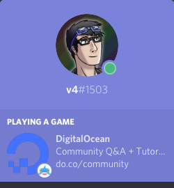
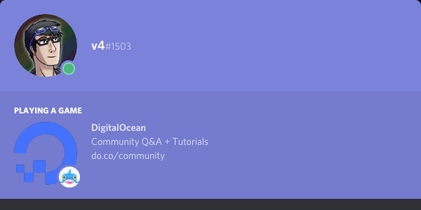

<!-- Source: https://github.com/MattIPv4/template/blob/master/README.md -->

<!-- Title -->
<h1 align="center" id="digitalocean-discord-presence">
    DigitalOcean Discord Presence
</h1>

<!-- Tag line -->
<h3 align="center">A node.js (discord.js) script that sets your Discord presence to the DigitalOcean community.</h3>

<!-- Badges -->

    
    
    

----

<!-- Content -->
## DO Discord RPC

<!-- Contributing -->
## Contributing

Contributions are always welcome to this project!\
Take a look at any existing issues on this repository for starting places to help contribute towards, or simply create your own new contribution to the project.

Please make sure to follow the existing standards within the project such as code styles, naming conventions and commenting/documentation.

When you are ready, simply create a pull request for your contribution and I will review it whenever I can!

### Donating

You can also help me and the project out by contributing through a donation on PayPal or by supporting me monthly on my Patreon page.

    
    

<!-- Discussion & Support -->
## Discussion, Support and Issues

Need support with this project, have found an issue or want to chat with others about contributing to the project?
> Please check the project's issues page first for support & bugs!

Not found what you need here?
* If you have an issue, please create a GitHub issue here to report the situation, include as much detail as you can!
* _or,_ You can join our Slack workspace to discuss any issue, to get support for the project or to chat with contributors and myself:

